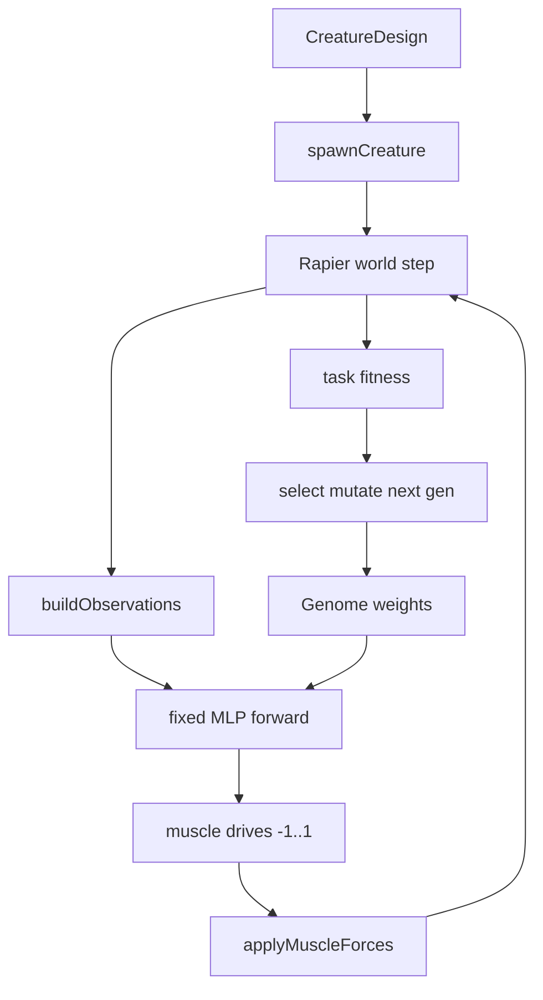

# Phase 2 — Neural Network & Evolution

**Status:** Implemented (v1) — fixed MLP + weight GA, run task, **live Keiwan-style batch observation**, `npm run smoke:evolve`  


**Depends on:** Phase 1 physics feel (complete)  
**App root:** [`Fresh Start/`](./) only — do **not** import from parent `src/neat.ts`, goals, or soft-body physics.

This doc is the handoff for a new session. Read this + [`README.md`](./README.md), then implement in order below.

---

## Goal

Add a Keiwan-style **brain** and **generational evolution** so a fixed body design can learn muscle control for a simple task (start with **run / horizontal distance**).

Physics and editor stay as Phase 1. Phase 2 only adds:

1. Observation → network → muscle drives `[-1, 1]`
2. Population evaluation + selection + mutation (weight evolution)
3. Minimal UI to start/stop evolve, watch best creature, see generation / fitness
4. Headless smoke that fitness improves on a braced preset

---

## What Keiwan does (reimplement behavior, not code)

From Evolution FAQ / documented behavior:

| Piece | Behavior |
|---|---|
| Network | Same topology for all creatures in a run; **only weights** differ |
| Outputs | **One float per muscle**, in `[-1, 1]`, at a fixed rate (**~30 Hz**) |
| Mapping | Sign = expand (−) / contract (+); magnitude = force fraction (already matches [`muscleDrive.ts`](./src/control/muscleDrive.ts)) |
| Inputs | Body state (e.g. height, velocity, rotation, ground contacts) |
| Learning | Genetic algorithm over weights; fitness from task performance |
| Body | Fixed during a simulation (morphology evolution is later) |

Do **not** start with full NEAT topology search (add-node / add-connection). Prefer a **fixed MLP** + weight GA first — closer to Keiwan and far easier to audit. Topology evolution can be a later optional phase if needed.

---

## Current Phase 1 hooks (use these)

| File | Role |
|---|---|
| [`src/control/muscleDrive.ts`](./src/control/muscleDrive.ts) | Applies drives `[-1, 1]` + spring |
| [`src/sim/simulation.ts`](./src/sim/simulation.ts) | Fixed-dt loop; `driveMode`: `idle` \| `manual` \| `sine` |
| [`src/creature/types.ts`](./src/creature/types.ts) | `CreatureDesign` graph |
| [`src/physics/spawn.ts`](./src/physics/spawn.ts) | Design → Rapier creature |
| [`scripts/smoke-feel.mts`](./scripts/smoke-feel.mts) | Pattern for headless Rapier tests |

**Integration plan:** extend `DriveMode` with `'brain'`, and each physics step (or every N steps for 30 Hz brain) set drives from `evaluateNetwork(obs, weights)`.

Keep `idle` / `manual` / `sine` — they remain the feel/debug tools.

---

## Architecture



Suggested new modules (all under `Fresh Start/src/`):

```
src/
  brain/
    types.ts          # Genome, NetworkShape, TaskId
    network.ts        # MLP forward: tanh layers, weight packing
    observations.ts   # buildObs(creature, world) → Float32Array
    tasks.ts          # fitness for 'run' (and stubs for later)
    evolve.ts         # population, evaluate, select, mutate
    constants.ts      # BRAIN_HZ, pop size, mutation σ, episode time
  sim/
    batchEval.ts      # optional: N invisible worlds for parallel eval
```

UI: Evolve panel on simulate mode (or a third “Evolve” mode) — generation, best fitness, play best genome, stop.

---

## Network design (v1)

**Fixed feed-forward MLP**, identical shape for a given (inputCount, muscleCount):

- Input size = observation vector length (see below)
- Hidden: **one layer**, width = `clamp(2 * max(inputs, outputs), 8, 32)` (tune in `brain/constants.ts`)
- Output size = `muscleCount`
- Activation: **tanh** on hidden and output (naturally `[-1, 1]` outputs)
- Genome = flat `Float32Array` of all weights + biases
- Init: small Gaussian (e.g. σ = 0.5)

Same body ⇒ same shape ⇒ genomes comparable and crossover-optional.

**Brain tick rate:** 30 Hz (Keiwan). Physics stays 60 Hz (`FIXED_DT`). Hold last brain outputs between ticks.

---

## Observations (v1)

Mirror Keiwan’s “basic brain inputs” spirit. Compute from spawned creature each brain tick:

| Index | Name | Notes |
|---|---|---|
| 0 | `height` | Lowest joint Y, or distance-from-ground proxy |
| 1 | `velX` | Mean joint linear velocity X |
| 2 | `velY` | Mean joint linear velocity Y |
| 3 | `angularVel` | Mean bone angular velocity |
| 4 | `rotation` | Mean bone angle (normalized, e.g. /π) |
| 5 | `groundContacts` | Count of joints near ground / contacting, normalized by joint count |

Scale inputs to roughly O(1) with divisors in `brain/constants.ts` (document the divisors).  
**Do not** add raycasts, object sensors, or multi-task inputs in v1.

Optional later: per-muscle current length / rest ratio (helps hopping) — only after run task works.

---

## Task & fitness (v1: Run)

**Episode:** fixed duration (e.g. **10 s** sim time), one creature, flat ground.  
**Spawn:** design posed above ground (existing spawn).  
**Fitness (unclamped, higher better):**

```
needed  = max(MIN_FOOT_LIFTS, Δx / DISTANCE_PER_LIFT)
quality = clamp(footLifts / needed, 0, 1)
fitness = max(0, Δx) * quality - fallPenalty
```

- `footLifts`: forward plant→clear steps only (hysteresis `PLANT_Y` → `LIFT_Y`, plant X must advance ≥ `MIN_STEP_PROGRESS`) so buzz / lift-then-slide scores ~0
- `DISTANCE_PER_LIFT`: required lifts grow with distance (quality cannot saturate after 3 pops)
- `fallPenalty`: if any joint Y < small threshold for too long, apply penalty (keep simple)
- Clamp displayed fitness for UI if desired; keep raw for selection

**Success gate for Phase 2:** on `Simple Hopper` or `Triangle Walker`, over ≥3 random seeds, best fitness after N generations (e.g. 40) is meaningfully above generation-0 random baseline (document thresholds in smoke).

Defer jump / climb / fly until run is stable.

---

## Evolutionary algorithm (v1)

Keep it boring and auditable:

| Param | Suggested default |
|---|---|
| Population | 40 |
| Episode time | 10 s |
| Elitism | keep top 2 |
| Selection | tournament (size 3) |
| Mutation | each weight += N(0, σ), σ ≈ 0.15; 5% chance reset weight |
| Crossover | optional uniform crossover of two parents (can ship without it first) |
| Generations | user-stop or max (e.g. 100) |

**Evaluation:** for each genome, `reset` creature, run episode with brain drive, record fitness. Determinism: fixed dt already; avoid `Math.random` inside physics. Seed mutation RNG per run for reproducible smokes.

**Performance:** start with **serial** eval (simplest). If too slow, add `batchEval` with multiple `RAPIER.World`s (still no shared old-sandbox code). UI should remain responsive (eval in chunks via `requestIdleCallback` / async generator / worker later — v1 can block with a progress label if episodes are short).

---

## UI (v1)

In simulate mode (or Evolve mode):

1. **Evolve** — start GA on current design  
2. **Stop** — halt after current genome/episode  
3. Readouts: generation, best fitness, mean fitness, episode progress  
4. **Play best** — load elite genome into interactive sim (`driveMode = 'brain'`)  
5. Keep Manual / Oscillate for debugging bodies without evolution  

Editor unchanged. Changing the design invalidates genomes (clear population; warn in UI).

---

## Explicit non-goals (Phase 2)

- Importing parent `src/neat.ts`, reward recipes, zones, secret goals, Arena
- Speciation, complexification, multi-objective Pareto
- Morphological evolution
- Wings, stairs, climbing, flying tasks
- Saving/loading creatures to disk (nice follow-up; not required for gate)
- Matching old sandbox observation quirks or fitness coefficients

---

## Implementation order

1. **`brain/network.ts` + unit-style checks** — pack/unpack weights; forward pass deterministic  
2. **`observations.ts`** — wire to `SpawnedCreature`; log ranges once on hopper  
3. **`DriveMode 'brain'`** in `simulation.ts` — 30 Hz evaluate + hold drives  
4. **`tasks.ts` run fitness** — headless one-episode script  
5. **`evolve.ts`** — pop loop serial; console progress  
6. **UI Evolve panel** — start/stop/play best  
7. **`scripts/smoke-evolve-run.mts`** — fitness improves vs baseline on hopper  
8. **Feel/pass polish** — mutation σ, episode length, input scales only; do not retune Phase 1 muscle springs unless evolve is blocked by physics (prefer brain/task knobs first)

---

## Acceptance criteria

Phase 2 is done when:

1. A braced preset can run under **Play best** with a non-random-looking gait after evolution.  
2. `npm run smoke:evolve` (or similar) passes: best fitness rises vs gen-0 on ≥2/3 seeds.  
3. Manual / sine / idle still work; `npm run smoke:feel` still passes.  
4. No dependency on parent-repo learning code.  
5. This doc’s “non-goals” remain out of tree.

---

## Follow-ups (Phase 3+, not now)

- Jump / climb fitness  
- Save elite genome + design JSON  
- Optional NEAT-like topology mutation  
- Parallel world batch eval / worker  
- Muscle-length observations; shared drive groups  

---

## Session start checklist

For the agent/human starting Phase 2:

1. Run `Fresh Start/start.bat` — confirm Phase 1 still feels right.  
2. Run `npm run smoke:feel` — must stay green.  
3. Read this file end-to-end.  
4. Implement steps 1→7 without opening parent `src/physics.ts` / `src/neat.ts` except as cautionary “what not to recreate.”  
5. Prefer small smokes over large UI before the GA works headless.
