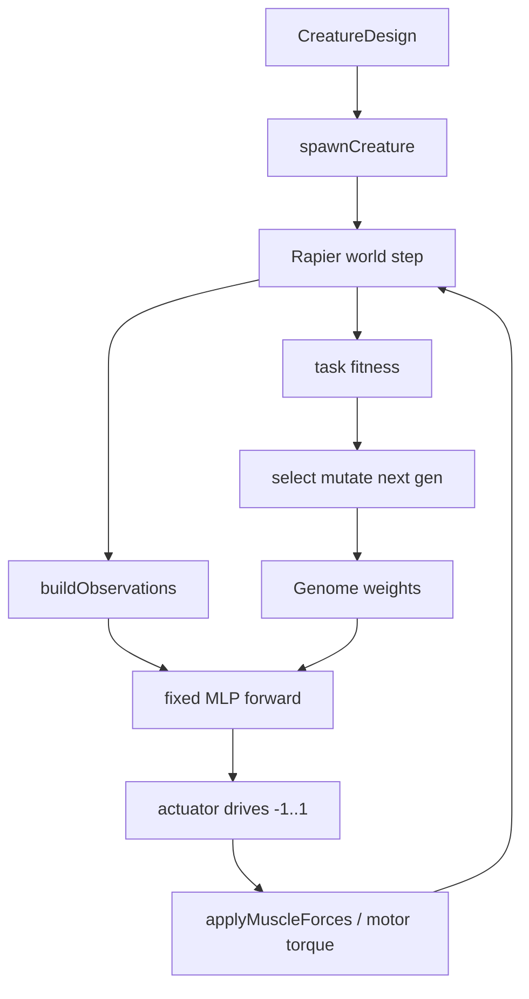

# Brain and evolution

Fixed **MLP** + **genetic algorithm** over weights (and optional morph / structure genes). Dance learning is a separate Disco path (SGD imitation, then optional Disco-local GA refine).

## Loop

Brain ticks at 30 Hz by default; physics stays 60 Hz (`FIXED_DT`). Last outputs are held between brain ticks.

## Network

Identical topology for every member of a run; only weights differ.

- Inputs: locomotion pack `OBS_COUNT = 12` (body stats, foot contact/clearance, terrain grade, head height, phase clock). Optional raycast whiskers append 5 ranges (`RAYCAST_OBS_COUNT`). Phase-clock frequency defaults to 2.5 Hz (`PHASE_CLOCK_HZ`); Train setup **Rhythm** can change it (0 = off). Changing frequency does not change genome shape.
- Boxing pack v3 and joust pack v2 start with that same loco prefix, then append opponent/weapon channels (`BOXING_OBS_COUNT = 24`, `JOUST_OBS_COUNT = 26`). Dance is loco prefix + audio + lookahead.
- Hidden: one tanh layer, width `clamp(2 * max(in, out), 8, 32)`.
- Outputs: one `[-1, 1]` channel per muscle, then one per motor wheel.
- Genome: packed weights + biases. Optional morph genes and padded structural channels when those Train toggles are on.
- Cross-skill transfer (`crossSkillTransfer`): a locomotion elite can prefix-expand into boxing, joust, or dance (raycast whiskers are dropped). Same-pack goals (Walk → Jump, etc.) reuse the brain as-is. Boxing ↔ joust and combat → walk are refused. One trained file stays one goal; Save trained after the new run.

Dance uses a larger obs pack (`DANCE_OBS_PACK_VERSION`). Imitation stays record-based; a transferred walk brain can seed Disco **Refine**. See [`DANCE_CURRICULUM.md`](./DANCE_CURRICULUM.md).

## Evolution

Tournament selection, elitism, Gaussian mutation, optional uniform crossover. Recipes and dock knobs live in `src/brain/trainingRecipes.ts` and the Train UI. Mid-run knob changes lock until Stop.

Goals and scoring: `src/goals/catalog.ts`, `src/brain/taskScore.ts`. Secrets: `src/secrets/`.

## Key modules

| Path | Role |
| --- | --- |
| `src/brain/network.ts` | MLP forward, seeded RNG |
| `src/brain/observations.ts` | Locomotion obs pack |
| `src/brain/ga.ts` | Select / mutate / crossover |
| `src/brain/evolve.ts` | Population loop |
| `src/sim/simulation.ts` | Live evolve, play-best, H2H, skill matches |
| `src/control/muscleDrive.ts` | Spring + active muscle forces |

## Smoke

`npm run smoke:evolve` (fitness rises vs gen-0) plus `smoke:train-recipes`, `smoke:structure-morph`, `smoke:raycast`, `smoke:skill-transfer`, and task/skill smokes in `npm run smoke:all`.
