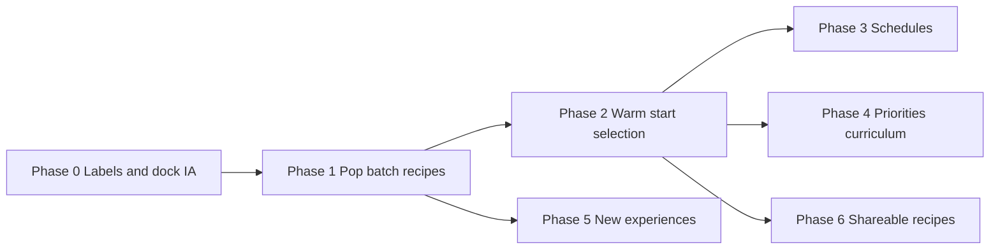

# Training experimentation — phased plan

**Product:** Solemn Sandbox (Fresh Start)  
**Status:** In progress — checklist IDs **D9–D15** marked `[x]` (2026-08-05)  
**Learning stack (locked):** fixed MLP + genetic algorithm; no NEAT port. Dance keeps imitation (SGD) + optional GA refine.

This plan turns the earlier recommendations (efficiency knobs, panel options, new experiences) into a phased product roadmap with **plain-language labels**, **where each control lives**, and **whether the current Train layout should change**.

---

## 1. Goals

| Audience | What they need |
|---|---|
| **First-time user** | One clear path: pick a goal → Evolve → Play best → Save model (`NameT`). Defaults that “just work.” |
| **Curious tinkerer** | A few named recipes (“Careful”, “Balanced”, “Wild”) without jargon. |
| **Skilled researcher** | Same controls, with optional Advanced revealing real parameters (pop size, σ, elites) and tooltips that map label → mechanism. |

**Copy rule:** Primary UI uses everyday words. Parenthetical or tooltip may add the scientific term once.

| Avoid in primary UI | Prefer |
|---|---|
| Mutation sigma / σ | How bold mutations are |
| Tournament selection | Who gets to breed |
| Elitism | Keep the champions |
| Population | How many try each round |
| Batch size | How many you watch at once |
| Domain randomization | Practice with messy bodies |
| Curriculum | Train in stages |

---

## 2. Current layout (baseline)

| Surface | Role today |
|---|---|
| **Top tabs** | Edit · Creatures · Train · World · Zone (Disco) · H2H · Discoveries |
| **Train side panel** | Goal picker, collapsible Controls note, Stats, Rewards, Network viz, Models hub |
| **Bottom dock (sim)** | Evolve / Stop / Play best / Continue / Save model · Env picker · **Speed** (observe, train, gen length, ghost pack) · Evolve stats |
| **Hardcoded** | Live pop `12`, batch `12`, mutation σ `0.15`, elites `2`, tournament `3` |

**Friction today**

1. “Controls” in the side panel mostly points at the bottom dock — split attention.
2. Speed / Gen length / Ghost sit under **Speed**, while Evolve actions sit under **Evolve** — related but not one story.
3. Models hub is easy to miss for “start from a saved brain.”
4. Save model now exports `NameT`, but nothing in the dock explains the naming.

---

## 3. Recommended layout & labelling changes

Do these early (Phase 0–1). They make later knobs findable without a second IA rewrite.

### 3.1 Rename for a clearer Train story

| Current | Proposed | Why |
|---|---|---|
| Side panel **Controls** | Remove or merge into dock; side panel keeps **Goal**, **Stats**, **Brain**, **Saved brains** | One place for “how training runs” |
| Dock **Speed** | **Watch & speed** | Speed is about watching, not genetics |
| Dock **Evolve (goal title)** | **Train · {Goal}** | Matches the Train tab |
| **Gen length** | **Try length** (tooltip: “How many seconds each creature gets per round”) | “Gen” confuses non-GA users |
| **Ghost pack** | **Show the others** | Clearer for first-timers |
| **Models hub** | **Saved brains** | Matches “brain” language elsewhere |
| **Continue** | **Keep training** | Clearer than Continue |
| **Save model** | Keep label; subtitle/tooltip: “Download trained brain as `{Name}T`” | Explains T suffix |

### 3.2 Dock information architecture (high importance)

Keep **one bottom dock** while simulating (do not bury Evolve in the side panel).

```text
┌─────────────────────────────────────────────────────────────────────────┐
│  [Train · Goal]   Evolve · Stop · Play best · Keep training · Save      │
│  Environment picker (compact)                                           │
├──────────────┬────────────────────────────┬─────────────────────────────┤
│ Watch & speed│ Training setup (new)       │ Progress                    │
│ Observe      │ How many try / watch       │ Gen · Best · Mean · status  │
│ Train speed  │ Try length                 │                             │
│ Show others  │ Recipe: Careful/Balanced…  │                             │
│              │ ▸ More options (advanced)  │                             │
└──────────────┴────────────────────────────┴─────────────────────────────┘
```

**Navigation rule**

- **Always visible while training:** Evolve actions + progress + Watch & speed.
- **Training setup:** default collapsed to a single **Recipe** row after Phase 1; expand for pop/batch/mutation.
- **Side Train panel:** Goal catalog, Saved brains, Brain picture, Stats/Rewards — not duplicate speed sliders.

### 3.3 Side panel order (Train tab)

Proposed order top → bottom:

1. **Goal** — what success means  
2. **How to train** — 3–4 line starter checklist (static help)  
3. **Saved brains** — load / keep training from `NameT`  
4. **Brain** — network visualizer  
5. **This run** — stats + rewards (collapse by default)

### 3.4 First-run help (lightweight)

One dismissible strip on first Train visit:

> 1. Pick a **Goal**  
> 2. Press **Evolve** — many brains try the course  
> 3. **Play best** to watch the winner  
> 4. **Save model** downloads `{CreatureName}T`

No tutorial modal maze.

---

## 4. Plain-language control dictionary

Use these labels everywhere (dock, recipes, docs tooltips).

| UI label | What it does | Why you’d change it | Mechanism (tooltip / Advanced) |
|---|---|---|---|
| **How many try** | Number of brains each round | More tries → usually steadier improvement, slower rounds | `populationSize` |
| **How many you watch** | Creatures on screen together | Lower = easier to follow; higher = busier pack | `batchSize` (≤ population) |
| **Try length** | Seconds each brain gets | Short = faster rounds, noisier scores; long = fairer tests | `episodeSeconds` |
| **Mutation style** | How different children are from parents | Wild explores; Careful fine-tunes | `MUTATION_SIGMA` + reset rate |
| **Keep the champions** | Top brains copied unchanged | Higher = less forgetting, less exploration | `ELITE_COUNT` |
| **Who gets to breed** | Strict vs lucky parent picks | Stricter = exploit best; looser = more variety | `TOURNAMENT_SIZE` |
| **Start from** | Random / this run’s best / a saved brain | Warm starts learn faster on related goals | seed genome |
| **Rounds limit** | Stop after N generations | Caps long runs | `maxGenerations` |
| **Watch speed / Train speed** | Playback vs how fast sim runs while evolving | Train Max = finish rounds quicker | `timeScale` |
| **Show the others** | Dim non-focused creatures | See the pack without clutter | ghost opacity |

**Recipes** (presets mapping several rows at once):

| Recipe | Plain pitch | Rough mapping |
|---|---|---|
| **Balanced** | Default sandbox feel | pop 12, batch 12, normal mutation, try 20s |
| **Quick look** | Fast feedback, rough scores | pop 12, batch 6, try 5–8s, bolder mutation |
| **Serious search** | Slower, stronger learning | pop 48–80, batch 8–12, try 20–40s, normal mutation |
| **Fine tune** | Polish a good brain | pop 24, batch 8, gentle mutation, start from best/saved |
| **Wild ideas** | Chaos for stuck runs | pop 36, wild mutation, short tries |

---

## 5. Phased implementation

Each phase lists: **user**, **where it lives**, **copy**, **deps**, **done when**.

### Phase 0 — Layout & language (no new learning math)

**Intent:** Make the existing system understandable before adding knobs.

| Work | Placement |
|---|---|
| Rename dock sections per §3.1–3.2 | Bottom dock |
| Side panel order + “How to train” blurb | Train side panel |
| Tooltip on **Save model** explaining `T` | Evolve button row |
| Replace side **Controls** collapsible with pointer-free dock ownership | Train side panel |
| Optional first-visit strip | Train tab once |

**Done when:** A new user can explain Evolve → Play best → Save without reading code. No behavior change to GA.

---

### Phase 1 — Core experimentation knobs (highest ROI)

**Intent:** Expose what the engine already supports (`populationSize`, `batchSize`) plus mutation recipes.

| Control | UI label | Placement |
|---|---|---|
| Population | **How many try** | Dock → Training setup |
| Batch | **How many you watch** | Dock → Training setup |
| Mutation preset | **Mutation style:** Careful / Balanced / Wild | Dock → Training setup |
| Recipe chips | **Balanced · Quick look · Serious search · Fine tune · Wild ideas** | Top of Training setup (sets several knobs) |

**Copy examples**

- How many try: “More brains each round. Higher is usually smarter but slower.”
- How many you watch: “Only changes the on-screen pack. Learning uses everyone in How many try.”
- Mutation style: “Careful = small tweaks. Wild = big random changes when stuck.”

**Implementation notes**

- Wire into `simulation.startLiveEvolve({ populationSize, batchSize, … })`.
- Persist last recipe in `localStorage` (session comfort, not a new package schema).
- Disable mid-run changes that would desync the live population (or apply “next round”).
- Keep defaults = today’s 12/12/normal so existing muscle memory holds.

**Done when:** User can run Serious search vs Quick look and see different pace/quality without opening DevTools.

---

### Phase 2 — Start conditions & selection (efficiency)

**Intent:** Warm starts and light selection control — big learning wins, still GA-native.

| Control | UI label | Placement |
|---|---|---|
| Init mode | **Start from:** Fresh random · Best of this run · Saved brain… | Dock → Training setup (or Evolve confirm) |
| Elites | **Keep the champions** (1–4) | Dock → ▸ More options |
| Tournament | **Who gets to breed:** Open / Normal / Strict | Dock → ▸ More options |
| Max gens | **Rounds limit** | Dock → ▸ More options |
| Seed display | **Run #** (reseed button) | Dock → ▸ More options |

**Saved brain picker:** reuse **Saved brains** list; “Keep training” on a row sets Start from that brain + jumps to Evolve.

**Copy**

- Start from saved: “Copy a trained brain, then keep improving it for this goal.”
- Keep the champions: “Always copy the top scorers into the next round unchanged.”

**Done when:** Fine tune recipe = gentle mutation + start from `NameT` in two clicks.

---

### Phase 3 — Smarter schedules (still explainable)

**Intent:** Efficiency without asking users to tune σ by hand.

| Feature | UI label | Placement | Plain why |
|---|---|---|---|
| Mutation annealing | **Settle down over time** (toggle) | ▸ More options | “Start exploratory, then fine-tune automatically.” |
| Adaptive try length | **Short tries first** (toggle) | ▸ More options | “Spend less time on early chaos; longer tests later.” |
| Early stop on fall | **Stop a try after a fall** (per-goal default) | Goal advanced or More options | “Don’t waste time on faces-down runs.” |
| Optional crossover | **Mix two parents** (toggle) | ▸ More options | “Children blend two good brains, then mutate.” |

**Researcher tooltips** may show schedules (e.g. σ from 0.25 → 0.08). Primary label stays non-numeric.

**Done when:** Serious search + Settle down beats Balanced on a smoke preset within similar wall-clock (document in smoke note, not user-facing).

---

### Phase 4 — Fitness pressure & mini-curricula

**Intent:** Same bodies, new “sports” via scoring emphasis — broadens experience without new solvers.

| Feature | UI label | Placement |
|---|---|---|
| Goal emphasis sliders | **What matters more:** Distance · Stay upright · Don’t fall (goal-dependent) | Train side panel under Goal → **Priorities** |
| Stage trainer | **Train in stages** | Side panel under Goal: checklist e.g. Stay tall → Run → Sprint |
| Env quick-swap during train | Already Env picker; add **Practice course** label | Dock env row |

**Copy:** “Priorities change the score mix. They don’t change physics.”

**Placement note:** Priorities live beside **Goal** (side panel), not in Speed — they define success, not playback.

**Done when:** User can favor upright vs distance and feel gaits change; stage checklist can auto-switch goal after a fitness threshold (opt-in).

---

### Phase 5 — New experiences (sandbox-native)

Ship as separate, flag-gated slices. Prefer Zone/Train discoverability over hidden menus.

| Idea | Plain name | Where it lives | What the user does |
|---|---|---|---|
| Teacher-seeded pop | **Copy my demo** | Train dock / Drive modes: record a few seconds of manual or sine → “Use demo as teachers” | Half the pack starts near the demo |
| Morphology jitter | **Practice with messy bodies** | ▸ More options or World practice flag | Masses/lengths jitter slightly each try |
| Rival ghost | **Race your record** | Play best / Evolve overlay toggle | Translucent previous best on course |
| Goal blend “custom sport” | **Mix goals** | Goal panel → Custom mix (simple 2–3 slider) | e.g. 70% run + 30% stay |
| Brain size | **Brain size:** Small / Normal / Wide | Creatures or Train setup (warns: incompatible with old saves) | New shape family |
| Season modifiers | **Today’s weather** | World or Train env chip: Calm / Windy / Slippery | Friction/wind presets |
| Co-play pressure | **Moving target** | World score region mode or Train challenge chip | Reward zone relocates each round |
| Asymmetry drills | **One-way course** | Goal variant or env preset | Reward only +X or only left side |

**Disco stays separate:** dance imitation/curriculum remains Zone/Disco — do not merge into Free Evolve. Optional later bridge: “Export dance brain” is already Disco-local; Phase 5 teacher-seed is the locomotion analogue.

**Done when:** At least two of {Copy my demo, Race your record, Mix goals, Messy bodies} ship behind flags with one-line help each.

---

### Phase 6 — Lab recipes & shareable experiments (optional product layer)

**Intent:** Researchers and creators save the whole experiment, not only the brain.

| Artifact | Plain name | Placement |
|---|---|---|
| Named knob set | **Training recipe** | Saved beside brains or under Creatures → Recipes |
| Bundle | **Experiment pack** = body + env + goal + recipe + brain | Export/import JSON (extend C5) |
| Gallery strip | **Try this setup** | Train side panel suggestions |

**Label:** “Recipe = how you search. Brain (`NameT`) = what you learned.”

Firewall: recipe JSON must not import parent NEAT/physics constants.

---

## 6. What not to do (in this plan)

| Out of scope | Reason |
|---|---|
| Port parent NEAT | Checklist / firewall locked |
| Replace Evolve with PPO/SAC as default | Breaks watch-the-pack UX; optional later Lab only if ever desired |
| Dashboard of 20 raw hyperparameters on first open | Overwhelms first-timers |
| Duplicate Evolve buttons in side panel and dock | Split attention |
| Auto-tune that hides all controls | Conflicts with experimentation goal |

---

## 7. Suggested checklist IDs (for when you mark work)

Add to `FEATURE_PORT_CHECKLIST.md` only when you want implementation:

| ID | Title | Phase |
|---|---|---|
| **D9** | Train dock IA + plain labels | 0 |
| **D10** | Population / batch / mutation recipes in dock | 1 |
| **D11** | Start-from + selection Advanced | 2 |
| **D12** | Annealing / adaptive try length / crossover toggles | 3 |
| **D13** | Goal priorities + stage trainer | 4 |
| **D14** | New experiences pack (demo teachers, rival ghost, mix goals, messy bodies) | 5 |
| **D15** | Shareable training recipes / experiment packs | 6 |

Checklist IDs are marked `[x]`. Open decisions locked in backlog Wave 6.

---

## 8. Implementation order (summary)



**Ship priority if time-boxed:** Phase 0 → 1 → 2. That alone unlocks most “experiment in the panel” value. Phases 3–5 broaden the fantasy; Phase 6 is for creators/research sharing.

---

## 9. Acceptance themes (all phases)

1. **Defaults unchanged** unless the user picks another recipe.  
2. **One primary Train path** remains obvious.  
3. Every new control has: label, one-sentence why, tooltip with “how,” optional advanced name.  
4. Physics firewall unchanged; knobs only touch `brain/` + Train UI + export metadata.  
5. After physics-adjacent work, `npm run smoke:all`; after GA knob work, extend smoke to assert breed still runs with non-default pop/batch.

---

## 10. Open decisions (ask before coding)

1. Mid-run knob changes: **lock until Stop** vs **apply next round**?  
2. Should **Serious search** hide the full pack (batch &lt; pop) by default?  
3. Is **Mix goals** a real custom goal ID or a temporary reward recipe on the active goal?  
4. Do experiment packs belong under Creatures, Train, or a future Lab tab?

When these are decided, mark D9+ on the checklist and implement phase-by-phase.
